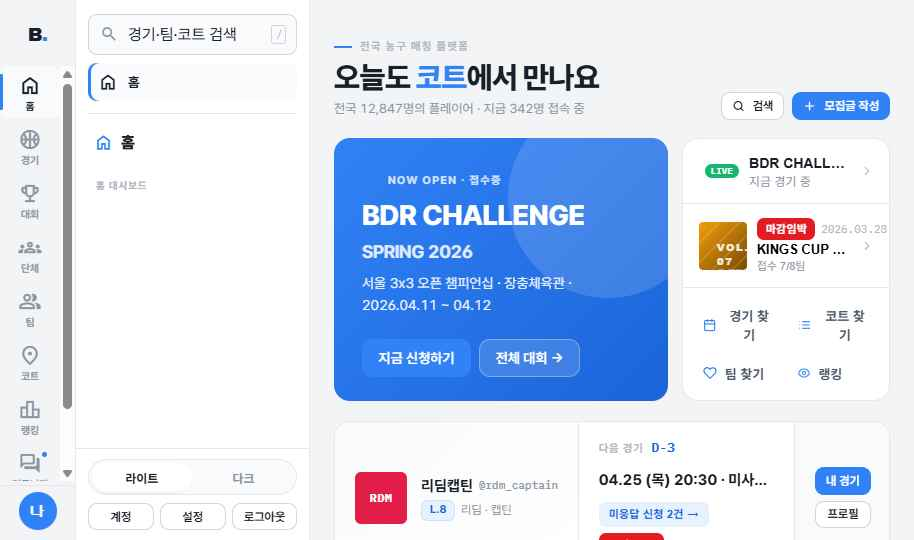
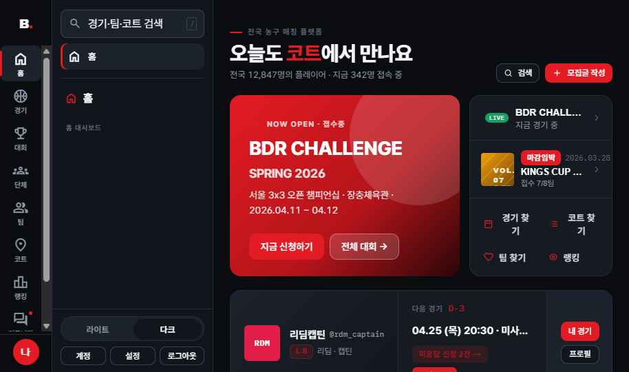
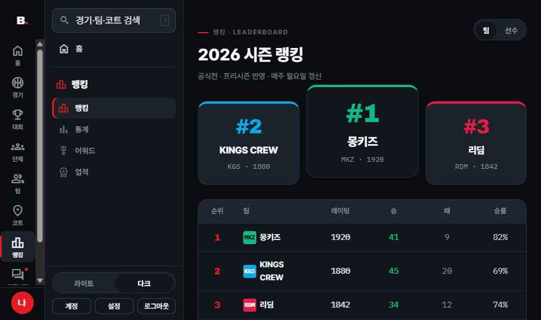
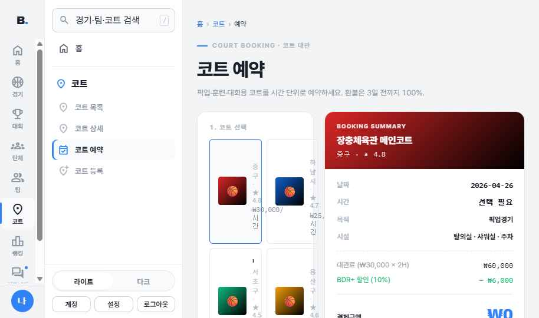

# Handoff: MyBDR 공식사이트 (v4 디자인 시스템 + DualSideNav 셸)

> **BDR-current = PUB-v1.0** — 공개웹(`(web)`) 전면 리뉴얼 시작점. 2026-06-30 sync(zip50 정본 단독 · 49=50 동일) · DS v4.
> 이전 정본(admin-toss v2.41)은 `_archive/BDR-current-2026-06-30-pre-PUB-v1.0/`에 보존(admin 시안 22 + _handoff 3폴더 포함).
> ⚠️ 박제 시 쟁점: 본 시안 README가 "라이트=토스 블루"로 표기 — CLAUDE.md 공개웹=BDR Red 정책과 대조 필요(PUB-0 IA 델타에서 결정).

## Overview
MyBDR(Basketball Daily Routine) — 전국 농구 매칭 플랫폼의 **사용자 공식사이트** 전체 SPA 디자인.
홈 대시보드 / 경기·매칭 / 대회·시리즈 / 단체 / 팀 / 코트 예약 / 랭킹·통계 / 커뮤니티 / 마이페이지 ·
결제 · 온보딩 · 인증 등 ~90개 화면을 단일 셸(좌측 2단 사이드네비) 안에서 라우팅한다.

라이트/다크 듀얼 모드를 지원하며 **모드당 단일 포인트 컬러**(라이트=토스 블루, 다크=BDR 레드)를 쓴다.

## About the Design Files
이 번들의 파일은 **HTML로 만든 디자인 레퍼런스**다 — 의도한 외형·동작을 보여주는 프로토타입이며,
그대로 운영에 붙여넣는 프로덕션 코드가 아니다. 작업 목표는 이 HTML 디자인을 **대상 코드베이스의
기존 환경(React/Next.js 등)과 그 패턴·라이브러리로 재구현**하는 것이다.
(운영 코드베이스는 Next.js — `cobby8/mybdr`. 기존 컴포넌트/라우팅/데이터 패칭을 재사용하고,
본 시안은 마크업·레이아웃·토큰·상호작용 참고용으로 사용한다.)

프로토타입은 단일 페이지에서 React(전역 UMD) + Babel(in-browser)로 구동되며, `_ds` 번들 없이
`tokens.css` + 복사된 `dual-sidenav.jsx` 만으로 **그대로 브라우저에서 실행**된다(`MyBDR.html` 열기).

## Fidelity
**High-fidelity (hifi).** 최종 색·타이포·간격·라운딩·상호작용이 확정된 픽셀 단위 시안.
개발자는 코드베이스의 기존 라이브러리/패턴으로 UI를 픽셀 정합하게 재현해야 한다.
컨텐츠(숫자·이름·전적 등)는 mock — 실제 데이터로 교체 필요.

## Screenshots
라이브 프로토타입 캡처(`MyBDR.html`). 라이트=토스 블루, 다크=BDR 레드 단일 포인트. 좌측 2단 DualSideNav 셸(아이콘 레일 76px + 컨텍스트 패널 234px)이 전 화면 공통.

**라이트 — 홈 대시보드 (promo hero + 셸: 레일 + 컨텍스트 패널)**

**다크 — 홈 대시보드 (BDR 레드 포인트, 소프트 다크 표면)**

**다크 — 랭킹·리더보드 (포디움 카드 + 테이블)**

**라이트 — 코트 예약 (예약 요약 패널)**

---

## 디자인 시스템 (MyBDR DS v4)

### 두 모드, 모드당 단일 포인트 컬러
`<html>` 의 `data-theme`(=`data-mode`) 속성으로 전환. `light` 기본.

| 슬롯 | LIGHT (토스 블루) | DARK (BDR 레드, 스포티 소프트) |
|---|---|---|
| `--bg` 페이지 | `#F2F4F6` | `#0A0C10` |
| `--bg-elev` / `--elev` | `#FFFFFF` | `#12161C` |
| `--bg-card` / `--card` | `#FFFFFF` | `#161B22` |
| `--bg-alt` / `--alt` | `#F9FAFB` | `#1C222B` |
| `--bg-head` / `--head` | `#F4F6F8` | `#1E2530` |
| `--ink` 본문 | `#191F28` | `#F4F6F8` |
| `--ink-soft` / `--soft` | `#4E5968` | `#C9D1DB` |
| `--ink-mute` / `--mute` | `#8B95A1` | `#8A95A3` |
| `--ink-dim` / `--dim` | `#B0B8C1` | `#5B6675` |
| `--border` | `#E5E8EB` | `#252C36` |
| `--border-strong` / `--bstrong` | `#D1D6DB` | `#39434F` |
| `--accent` / `--primary` 포인트 | `#3182F6` | `#E31B23` |
| `--primary-deep` (hover) | `#1B64DA` | `#B3141A` |
| `--accent-soft` / `--soft-fill` | `#E8F1FE` | `rgba(227,27,35,.16)` |
| `--shadow` | `rgba(20,28,40,.14)` | `rgba(0,0,0,.50)` |

> `--cafe-blue*` 슬롯은 포인트 컬러와 동일하게 collapse(라이트=블루, 다크=레드)되어 제2 색조가 없다.
> chrome(네비 active, promo 그라데이션 등)은 모두 이 단일 포인트를 사용한다.

### 고정 토큰 (모드 공통)
- 브랜드 레드 `--bdr-red`/`--red` = `#E31B23` — LIVE/기록/브랜드 모먼트 전용 고정색.
- 시맨틱: `--ok #15B66E` · `--warn #FF9500` · `--danger #E24C4B` · `--info #3182F6`.

### 라운딩 (소프트, 토스 스타일 — 브루탈리즘 없음)
칩/뱃지 `7px` · 입력 `9px` · **버튼 `11px`** · 표면 `13px` · **카드 `16px`** · 원형은 `50%`.
다크 모드도 동일 소프트 라운딩(각진 모서리·하드 그림자·흰 테두리 사용 안 함).

### 타이포
- Display = **Archivo** (`--ff-display`, weight 800, tight tracking, 큰 tabular 숫자)
- Body = **Pretendard** (`--ff-body`, 400–700, 한글 우선)
- Mono = **IBM Plex Mono** (`--ff-mono`, 스탯·점수·라우트·eyebrow, tabular)
- Type scale(공통): hero `clamp(30,3.6vw,46)` · h1 30 · h2 23 · h3 18 · body 14 · small 13 · micro 11 · line-height 1.6
- eyebrow = 짧은 포인트색 tick(`::before` 18×2px) + 대문자 mono 키커.

### 간격 / 그리드
4px 베이스: `--s-1`4 · `-2`8 · `-3`12 · `-4`16 · `-5`20 · `-6`24 · `-8`32 · `-10`40. 콘텐츠 max-width `--maxw` 1200px, gutter 24px(모바일 14px).

### 아이콘
**Material Symbols Outlined** (CDN) 단일 시스템. `name`. lucide/heroicons 등 금지. 이모지는 보조(🏀 인사말 등)만.

---

## 네비게이션 셸 — DualSideNav (핵심)
공식사이트는 **2단 좌측 사이드네비**를 셸로 쓴다 (`dual-sidenav.jsx`, DS의 `DualSideNav`).

**구조 (≥921px):**
- **아이콘 레일** (폭 76px, `--bg`, 우측 1px border, sticky 100vh): 9개 메인 섹션 버튼(아이콘 23px + 라벨 10.5px). active = `--alt` 배경 + 좌측 3px 포인트색 bar + 포인트색 아이콘. 하단 `railFooter`(38px 아바타, 원형/다크는 9px squircle).
- **컨텍스트 패널** (폭 234px, `--bg-elev`, sticky 100vh): 상단 고정 검색(`9px` radius) + 홈 버튼 → 구분선 → 활성 섹션의 서브메뉴(그룹 캡션 + sublink). sublink active = `--alt` + 좌측 inset 3px 포인트색. 하단 `panelFooter`(테마 토글 + 계정/설정/로그아웃).
- **콘텐츠** (`flex:1`): 현재 화면.

**모바일 (≤920px):** 레일+패널이 고정 오버레이로 숨겨지고, 좌측 가장자리 **드래그 핸들**(3단 스냅: 숨김 → 레일 → 듀얼, 손가락 1:1 추적). ESC/백드롭으로 닫힘. `prefers-reduced-motion` 가드 포함.

**Props/IA:** `sections`(레일), `ctx`(섹션별 서브메뉴 맵), `activeSection`/`activeSub`, `onNavSection`/`onNavSub`/`onHome`, `brand`/`brandFull`, `railFooter`/`panelFooter`, `searchPlaceholder`. 자세한 시그니처는 `dual-sidenav.jsx` 상단 주석 참고.

**섹션(레일) → 라우트 매핑** (MyBDR.html App 의 `NAV_SECTIONS`/`NAV_CTX`):
- 홈 `home`
- 경기 `games`: 경기 목록`games` · 경기 만들기`createGame` · 매칭`match` · 라이브`live` · 연습경기`scrim` · 대진표`bracket` · (내 경기) 내 경기`mygames` · 일정`calendar`
- 대회 `tournament`: 대회 상세`tournamentDetail` · 대회 일정`tournamentSchedule` · 참가팀`tournamentTeams` · 참가신청`tournamentEnroll` · (시리즈) 시리즈`series` · 시리즈 생성`seriesCreate`
- 단체 `orgs`: 단체 목록`orgs` · 단체 상세`orgDetail`
- 팀 `team`: 팀 목록`team` · 팀 상세`teamDetail` · 팀 만들기`createTeam` · 팀 관리`teamManage` · 팀 초대`teamInvite`
- 코트 `court`: 코트 목록`court` · 코트 상세`courtDetail` · 코트 예약`courtBooking` · 코트 등록`courtAdd`
- 랭킹 `rank`: 랭킹`rank` · 통계`stats` · 어워드`awards` · 업적`achievements`
- 커뮤니티 `board`: 게시판`board` · 갤러리`gallery` · 후기`reviews`
- 마이 `mypage`: (내 활동) 내 활동`myActivity` · 신청 현황`myRegistrations` · 보관함`saved` · 쪽지`messages` · 알림`notifications` · (계정·설정) 프로필`profile` · 프로필 편집`editProfile` · 설정`settings` · 요금제`pricing`

> 서브메뉴에 없는 상세/플로우 라우트(예: `gameDetail`, `post`, `login`, `signup`, `checkout`, `about`, `terms` 등)는 `NAV_EXTRA` 로 섹션 하이라이트만 매핑하거나 home 으로 폴백한다.

---

## Screens / Views (화면 인벤토리)
모든 화면은 `screens/<Name>.jsx` 의 React 컴포넌트이며 `setRoute(id)` 로 전환된다.
공통: 화면 폭 `.page`(max 1200px) 안에 카드/리스트/테이블 구성. 720px 모바일 분기(`responsive.css`).

**홈/대시보드** — `Home` (포인트색 promo hero, 다가오는 경기, 빠른 진입, 활동 요약)
**경기·매칭** — `Games`(필터 칩 + 모집 카드), `GameDetail`, `CreateGame`, `Match`/`MatchDetail`, `Live`(스코어버그), `Scrim`, `Bracket`(대진 트리), `Calendar`, `MyGames`
**대회·시리즈** — `TournamentDetail`, `TournamentSchedule`, `TournamentTeams`, `TournamentEnroll`, `Series`/`SeriesDetail`/`SeriesCreate`
**단체/팀** — `Orgs`/`OrgDetail`, `Team`/`TeamDetail`/`CreateTeam`/`TeamCreate`/`TeamManage`/`TeamInvite`, `PlayerProfile`, `Coaches`
**코트** — `Court`/`CourtDetail`/`CourtBooking`/`CourtAdd`
**랭킹/기록** — `Rank`, `Stats`, `Awards`, `Achievements`, `Reviews`, `Gallery`
**커뮤니티** — `BoardList`(게시판 테이블), `PostDetail`, `PostWrite`
**마이/계정** — `MyActivity`, `MyRegistrationStatus`, `Saved`, `Messages`, `Notifications`, `Profile`(+`ProfileBasketball`/`ProfilePreferences`/`ProfilePayments`/`ProfileSubscription`/`ProfileNotificationSettings`), `EditProfile`, `Settings`, `NotificationSettings`
**결제** — `Pricing`/`PricingSuccess`/`PricingFail`, `Checkout`, `Billing`, `Invite`
**가입·인증·온보딩** — `Login`, `Signup`, `PasswordReset`, `Verify`, `OnboardingV2`(+ `OnboardingIdentity`/`Basketball`/`Environment`/`Preferences`/`Setup`)
**정보·지원·기타** — `About`, `Help`, `Safety`, `Shop`, `Search`/`SearchResults`, `RefereeRequest`, `Terms`, `Privacy`, `NotFound`

> 각 화면의 정밀 레이아웃·카피·상태는 해당 `.jsx` 파일이 단일 출처(source of truth). 픽셀/문구는 그 코드를 따른다.

## Interactions & Behavior
- **라우팅:** App 의 `route` state. `setRoute(id)` 로 전환, `localStorage('mybdr.route')` 에 영속(새로고침 유지). `?route=<id>` 쿼리로 딥링크.
- **테마 토글:** 패널 푸터 라이트/다크. `data-theme`+`data-mode` 동기화, `localStorage('mybdr.theme')`. 모드 전환 크로스페이드 .35s.
  - ⚠️ 버튼 등 포인트색 배경은 `transition` 에 `background` 를 넣지 않는다(테마 토글 시 CSS `var()` 보간 고착 버그 회피). hover 색 변화는 즉시.
- **온보딩 모달:** 첫 방문(`!localStorage('mybdr.onbDone')`) 시 라이트/다크 선택 모달. `?route=` 진입 시 skip.
- **모바일 네비:** DualSideNav 드래그 핸들 3단 스냅(위 셸 설명).
- **호버:** 카드 `translateY(-2~3px)` + `--sh-md`; 링크/탭 `--bg-alt`. **포커스:** `2px var(--primary)` 링. **disabled:** opacity .45.
- **반응형:** 720px 분기 — 테이블→카드, 멀티컬럼→단일, iOS 입력 16px, 터치 타겟 44px.

## State Management
- `route` (현재 화면), `activeBoard` (게시판 선택), `theme` (light|dark), `onbOpen` (온보딩 모달). 모두 `localStorage` 영속.
- `activeSection`/`activeSub` 는 `route` 에서 파생(`navSectionOf`). 별도 저장 없음.
- 실제 구현 시 데이터(경기/대회/팀/유저/게시글 등)는 mock 객체(`data.jsx`/`community-data.jsx`/`extras-data.jsx`)를 운영 API/쿼리로 교체.

## Design Tokens
위 "디자인 시스템" 섹션의 표 + 라운딩/타이포/간격 참조. 단일 출처는 `tokens.css`.

## Assets
- 아이콘: Material Symbols Outlined (Google Fonts CDN) — 별도 에셋 없음.
- 폰트: Archivo / IBM Plex Mono / Material Symbols = CDN, Pretendard = jsDelivr CDN.
- 브랜드: 워드마크는 텍스트(`MyBDR` + 레드 dot)로 렌더(이미지 의존 없음). 운영 로고는 코드베이스 브랜드 자산 사용.
- 사진/이미지 없음(타이포·토큰 표면 기반 chrome).

## Files (이 번들)
- `MyBDR.html` — 앱 진입점(라우터 + 셸 조립 + Tweaks 패널 + 테마/온보딩 wiring). **여기를 먼저 열어 전체를 본다.**
- `tokens.css` — v4 디자인 토큰 + 공용 컴포넌트 클래스(.btn/.card/.badge/.board/.drawer/.modal 등).
- `responsive.css` — 720px 모바일 오버라이드.
- `dual-sidenav.jsx` — DualSideNav 셸 컴포넌트(자체 CSS 주입, `window.DualSideNav`).
- `components.jsx` — 공용 컴포넌트(Icon, ThemeSwitch, NavBadge, Onboarding, Pager, Sidebar, Modal, Avatar 등). *AppNav 는 DualSideNav 로 대체되어 제거됨.*
- `components-global.jsx` — 추가 전역 컴포넌트.
- `data.jsx` / `community-data.jsx` / `extras-data.jsx` — mock 데이터.
- `screens/` — 전 화면 컴포넌트(~88개) + `_GlobalComponents.jsx`.

### 실행
`MyBDR.html` 을 브라우저로 열면 됨(인터넷 필요 — React/Babel/폰트 CDN). 라우트는 `?route=games` 등으로 딥링크.
