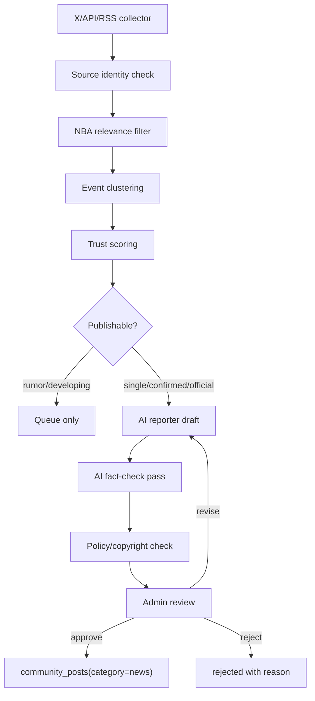

# NBA 뉴스룸 MVP 계획

작성일: 2026-07-02
범위: 계획/설계 초안. 운영 DB 스키마와 서비스 코드는 아직 변경하지 않는다.

## 1. 목표

X의 NBA 저명 기자, 공식 NBA/팀 계정, 검증된 매체 소식을 빠르게 감지해 BDR NEWS에 가까운 품질의 NBA 뉴스피드를 만든다. 핵심은 "빠른 요약봇"이 아니라, 출처와 검증 상태를 남기는 AI 스포츠 데스크다.

| 목표 | 기준 |
|---|---|
| 속보성 | 5~15분 단위 수집/분류 |
| 객관성 | 확인 상태, 출처 수, 원문 링크 표시 |
| 품질 | 실제 기자 기사처럼 제목/리드/본문/배경/영향을 분리 |
| 안전성 | 원문 복붙 금지, 루머와 공식 확인 분리 |
| 운영성 | 초기에는 AI 초안 + 관리자 승인 발행 |

## 2. 기본 원칙

1. X 원문 전문을 재배포하지 않는다.
2. 원문은 post id, URL, 작성자, 작성 시각, 짧은 근거 요약만 보관한다.
3. 기사 본문은 AI가 독자적으로 작성하되, 수집된 근거 밖의 사실을 만들지 않는다.
4. 단독 보도는 제목/리드에 "A 기자에 따르면"을 명시한다.
5. 공식 발표 전에는 `official` 라벨을 쓰지 않는다.
6. 루머, 협상 중, 관심 있음, 합의 완료, 공식 발표를 서로 다른 상태로 다룬다.
7. 최초 MVP는 자동 발행이 아니라 관리자 승인 발행이다.

## 3. 기존 BDR NEWS와의 관계

현재 프로젝트에는 이미 `community_posts(category="news")` 기반 BDR NEWS가 있다.

| 기존 구조 | NBA 뉴스룸에서의 사용 |
|---|---|
| `community_posts` | 최종 발행된 기사만 저장 |
| `/admin/news` | 최종 검수/발행 콘솔로 재사용 가능 |
| `/news` | 공개 뉴스피드 출력 경로로 재사용 가능 |
| `admin-news.ts` server actions | 발행/거절/수정 흐름 재사용 가능 |

NBA 전용 수집/검증 데이터는 별도 테이블에 보관하고, 발행 승인 시에만 `community_posts`로 복사한다. 이렇게 하면 기존 BDR 경기 기사와 NBA 소스 수집 로그가 섞이지 않는다.

## 4. 수집 소스 등급

| 등급 | 예시 | 발행 정책 |
|---|---|---|
| `official` | NBA, 팀 공식 계정, 리그 발표 | 자동 초안 생성 가능 |
| `tier_1_reporter` | 리그 대표 기자, 주요 매체 lead reporter | 단독 보도 가능, 제목에 출처 명시 |
| `beat_reporter` | 팀 전담 기자 | 팀 관련 맥락에 강함, 교차 확인 권장 |
| `media` | ESPN, The Athletic, AP 등 | 기사 링크 기반 보조 출처 |
| `rumor_watch` | 루머/집계 계정 | 발행 금지. 이벤트 감지 신호로만 사용 |

## 5. 데이터 흐름

```mermaid
flowchart LR
  A["Source registry"] --> B["Collector"]
  B --> C["Raw source posts"]
  C --> D["Event clustering"]
  D --> E["Verification scoring"]
  E --> F["AI article draft"]
  F --> G["Editorial checks"]
  G --> H["Admin review"]
  H --> I["community_posts news"]
  I --> J["Public /news feed"]
```



## 6. 기사 상태

| 상태 | 의미 | 자동 발행 |
|---|---|---|
| `draft` | AI 초안 생성됨 | 불가 |
| `needs_review` | 관리자 확인 필요 | 불가 |
| `ready` | 검수 통과, 발행 대기 | MVP에서는 수동 |
| `published` | 공개 발행 완료 | 해당 없음 |
| `rejected` | 폐기 | 불가 |
| `superseded` | 후속 기사로 대체 | 불가 |

## 7. 검증 상태

| 상태 | 의미 | 기사 표현 |
|---|---|---|
| `official` | 팀/리그 공식 확인 | "~가 공식 발표했다" |
| `confirmed_multiple` | 독립된 복수 신뢰 출처 확인 | "복수 보도에 따르면" |
| `reported_single` | 신뢰 기자 단독 보도 | "A 기자에 따르면" |
| `developing` | 진행 중/추가 확인 필요 | "상황은 유동적이다" |
| `rumor` | 루머/비공식 신호 | 발행하지 않음 또는 명확한 루머 라벨 |

## 8. Prisma 모델 초안

주의: 아래는 검토용 초안이며 `prisma/schema.prisma`에 아직 반영하지 않는다.

```prisma
model nba_news_sources {
  id              BigInt   @id @default(autoincrement())
  platform        String   @db.VarChar(32) // x, rss, web, official_site
  source_type     String   @db.VarChar(32) // official, tier_1_reporter, beat_reporter, media, rumor_watch
  display_name    String   @db.VarChar(120)
  handle          String?  @db.VarChar(120)
  source_url      String?  @db.VarChar(500)
  team_code       String?  @db.VarChar(8)
  trust_score     Int      @default(50)
  is_active       Boolean  @default(true)
  notes           String?
  created_at      DateTime @default(now()) @db.Timestamp(6)
  updated_at      DateTime @updatedAt @db.Timestamp(6)

  posts nba_source_posts[]

  @@index([platform, handle])
  @@index([source_type, is_active])
}

model nba_source_posts {
  id              BigInt   @id @default(autoincrement())
  source_id       BigInt
  platform        String   @db.VarChar(32)
  external_id     String   @db.VarChar(120)
  external_url    String   @db.VarChar(500)
  posted_at       DateTime @db.Timestamp(6)
  captured_at     DateTime @default(now()) @db.Timestamp(6)
  text_excerpt    String?  @db.VarChar(500)
  ai_summary      String?
  language        String?  @db.VarChar(16)
  raw_meta        Json     @default("{}")

  source nba_news_sources @relation(fields: [source_id], references: [id], onDelete: Cascade)
  event_links nba_event_sources[]

  @@unique([platform, external_id])
  @@index([posted_at])
  @@index([source_id, posted_at])
}

model nba_news_events {
  id                  BigInt   @id @default(autoincrement())
  event_type          String   @db.VarChar(32) // trade, injury, signing, waiver, game, quote, discipline
  subject_team_code   String?  @db.VarChar(8)
  subject_player_name String?  @db.VarChar(120)
  normalized_title    String   @db.VarChar(240)
  verification_status String   @default("reported_single") @db.VarChar(32)
  confidence_score    Int      @default(50)
  first_seen_at       DateTime @db.Timestamp(6)
  last_seen_at        DateTime @db.Timestamp(6)
  status              String   @default("open") @db.VarChar(32) // open, confirmed, closed, false_alarm
  created_at          DateTime @default(now()) @db.Timestamp(6)
  updated_at          DateTime @updatedAt @db.Timestamp(6)

  sources  nba_event_sources[]
  articles nba_news_articles[]

  @@index([event_type, last_seen_at])
  @@index([verification_status])
}

model nba_event_sources {
  id             BigInt @id @default(autoincrement())
  event_id       BigInt
  source_post_id BigInt
  role           String @default("primary") @db.VarChar(32) // primary, corroborating, official, background

  event nba_news_events @relation(fields: [event_id], references: [id], onDelete: Cascade)
  post  nba_source_posts @relation(fields: [source_post_id], references: [id], onDelete: Cascade)

  @@unique([event_id, source_post_id])
  @@index([source_post_id])
}

model nba_news_articles {
  id                  BigInt   @id @default(autoincrement())
  event_id            BigInt
  community_post_id   BigInt?
  title               String   @db.VarChar(240)
  lead                String?
  body                String
  source_note         String?
  verification_status String   @db.VarChar(32)
  editorial_status    String   @default("draft") @db.VarChar(32)
  ai_model            String?  @db.VarChar(80)
  ai_prompt_version   String?  @db.VarChar(80)
  quality_score       Int?
  published_at        DateTime? @db.Timestamp(6)
  created_at          DateTime @default(now()) @db.Timestamp(6)
  updated_at          DateTime @updatedAt @db.Timestamp(6)

  event nba_news_events @relation(fields: [event_id], references: [id], onDelete: Cascade)

  @@index([editorial_status, created_at])
  @@index([community_post_id])
}
```

## 9. AI 기자 작성 규칙

### 입력

| 입력 | 설명 |
|---|---|
| source posts | 원문 URL, 작성자, 시각, 짧은 excerpt |
| verification status | 공식/복수/단독/루머 |
| event context | 팀, 선수, 이벤트 유형 |
| background facts | DB 또는 승인된 외부 데이터에서 확인된 배경 |

### 출력

| 필드 | 규칙 |
|---|---|
| title | 과장 금지. 단독 보도는 출처 포함 |
| lead | 핵심 사실 1~2문장 |
| body | 사실, 배경, 영향 순서 |
| source_note | "출처: A 기자 X 게시물, 팀 공식 발표" |
| uncertainty_note | 확인되지 않은 부분이 있으면 별도 표시 |

### 금지 표현

| 유형 | 예시 |
|---|---|
| 과장 | 충격, 대박, 난리, 완전 확정 |
| 단정 | 공식 확인 전 "확정됐다" |
| 창작 | 계약 금액, 부상 기간, 트레이드 조건을 근거 없이 생성 |
| 팬덤성 | 특정 팀/선수 편드는 표현 |

## 10. AI 프롬프트 초안

```text
너는 NBA 전문 기자다. 아래 출처만 근거로 한국어 기사를 작성한다.

규칙:
1. 출처에 없는 사실을 만들지 않는다.
2. 공식 확인 전에는 "공식 발표"라고 쓰지 않는다.
3. 단독 보도는 제목 또는 리드에 기자명을 명시한다.
4. 루머/협상/관심/합의/공식 발표를 구분한다.
5. 원문 문장을 길게 베끼지 않는다.
6. 감정적 표현과 팬덤성 표현을 쓰지 않는다.
7. 불확실한 내용은 "추가 확인이 필요하다"라고 분리한다.

출력 JSON:
{
  "title": "...",
  "lead": "...",
  "body": "...",
  "source_note": "...",
  "uncertainty_note": "...",
  "verification_status": "reported_single | confirmed_multiple | official | developing | rumor"
}
```

## 11. 관리자 화면 MVP

| 화면 | 기능 |
|---|---|
| 소스 관리 | 기자/공식 계정 등록, 등급, 활성 여부 |
| 수집 로그 | 최근 수집 post, 중복 여부, 이벤트 연결 |
| 이벤트 큐 | 같은 이슈 묶음, 검증 상태, 출처 수 |
| 기사 초안 | AI 기사 미리보기, 출처 확인, 재작성 |
| 발행 | `community_posts(category="news")`로 발행 |

## 12. 공개 뉴스피드 MVP

기존 `/news`를 재사용하되, NBA 뉴스가 추가되면 카테고리/라벨 분리가 필요하다.

| 라벨 | 설명 |
|---|---|
| NBA 속보 | 공식/복수 확인 중심 |
| NBA 단독 인용 | 신뢰 기자 단독 보도 |
| NBA 업데이트 | 기존 이벤트 후속 |
| NBA 분석 | 공식 정보 기반 배경/영향 정리 |

초기에는 기존 `period_type`을 건드리지 말고, NBA 발행글 본문 상단에 상태 라벨을 포함하는 방식이 가장 작다. 이후 별도 `news_type` 컬럼이나 `images` JSON 메타 확장을 검토한다.

## 13. 자동화 단계

| 단계 | 발행 정책 | 조건 |
|---|---|---|
| Phase 1 | AI 초안 + 관리자 승인 | MVP |
| Phase 2 | official/confirmed_multiple만 자동 발행 후보 | 오보율 측정 후 |
| Phase 3 | 자동 발행 + 사후 모니터링 | 충분한 운영 데이터 확보 후 |

## 14. 구현 순서

| 순서 | 작업 | 산출물 |
|---|---|---|
| 1 | 본 설계 검토 | 확정 범위 |
| 2 | 소스 목록 1차 작성 | 기자/공식 계정 seed 후보 |
| 3 | Prisma 모델 확정 | schema diff 검토 |
| 4 | 수집기 프로토타입 | 수집 로그만 저장 |
| 5 | 이벤트 클러스터링 | 중복/같은 이슈 묶기 |
| 6 | AI 초안 생성 | `nba_news_articles` draft |
| 7 | 관리자 검수 화면 | 승인/거절/재작성 |
| 8 | 기존 BDR NEWS 발행 연결 | `community_posts` 생성 |
| 9 | 공개 피드 라벨링 | NBA 뉴스 구분 |
| 10 | 품질/오보 로그 | 자동 발행 확대 판단 |

## 15. 첫 개발 작업 제안

첫 코드 작업은 DB migration이 아니라, 운영 영향이 없는 내부 문서/시드 초안부터 시작한다.

| 우선순위 | 작업 |
|---|---|
| P1 | NBA 소스 목록 seed 초안 문서화 |
| P1 | Prisma 모델 최종안 리뷰 |
| P2 | `src/lib/nba-news/` 타입 정의만 추가 |
| P2 | 수집기 인터페이스 작성, 실제 X API 호출은 비활성 |
| P3 | 관리자 화면 와이어프레임 |

## 16. 남은 결정

| 결정 | 선택지 | 추천 |
|---|---|---|
| X API 사용 | 공식 API / RSS+웹 링크 병행 / 수동 등록 | 공식 API + 보조 소스 병행 |
| 자동 발행 | 즉시 자동 / 승인 후 발행 | 승인 후 발행 |
| 기존 `/news` 통합 | 즉시 통합 / NBA 탭 분리 | 초기 통합, 이후 탭 분리 |
| 스키마 방식 | NBA 별도 테이블 / `community_posts` 확장 | 별도 테이블 + 최종 발행만 연결 |
| 기사 톤 | 한국 스포츠지 스타일 / AP식 건조함 / BDR 매거진 톤 | AP식 객관성 + 읽기 쉬운 한국어 |

## 17. Source Registry v1

사용자가 제공한 X 분석을 기반으로 하되, seed 반영 전 최신 소속/활동 상태를 확인한다. 특히 기자 계정은 이직, 독립 뉴스레터 전환, 활동 중단이 잦으므로 `verified_at` 개념을 운영 절차에 포함한다.

| Tier | 이름 | X handle | 주요 역할 | MVP 사용 정책 |
|---|---|---|---|---|
| T0 | NBA | `@NBA` | 리그 공식 발표/일정/수상 | 공식 확인 소스 |
| T0 | NBA Communications | `@NBAPR` | 리그 공식 커뮤니케이션 | 징계/수상/규정 공식 확인 |
| T1 | Shams Charania | `@ShamsCharania` | 트레이드, 계약, 부상 속보 | 단독 보도 가능. 제목/리드에 출처 명시 |
| T1 | Marc Stein | `@TheSteinLine` | FA, 트레이드 시장, 리그 동향 | 높은 신뢰. 복수 확인 시 자동 발행 후보 |
| T2 | Brian Windhorst | `@WindhorstESPN` | 리그 맥락, 스타 플레이어, ESPN 리포팅 | 배경/해설 강화용 |
| T2 | Tim Bontemps | `@TimBontemps` | ESPN 리포팅, 분석, 리그 동향 | 확인/보조 출처 |
| T2 | Chris Haynes | `@ChrisBHaynes` | 선수 측 소스, 플레이어 무브 | 단독은 `reported_single`로 발행 대기 |
| T2 | Jake Fischer | `@JakeLFischer` | 트레이드 시장, 루머, 리그 노트 | 기본 `developing`, 교차 확인 권장 |
| T4 | Zach Lowe | `@ZachLowe_NBA` | 심층 분석, 전술/로스터 맥락 | 속보보다는 배경/분석 기사에 사용 |
| T4 | Kevin O'Connor | 최신 handle 확인 필요 | 분석, 드래프트, 로스터 관점 | seed 전 최신 소속/handle 검증 |
| T3 | Ian Begley | `@IanBegley` | Knicks beat | 팀별 보조/교차 확인 |
| T3 | Steve Popper | `@StevePopper` | Knicks beat | 팀별 보조/교차 확인 |
| T3 | Jay King | `@ByJayKing` | Celtics beat | 팀별 보조/교차 확인 |
| T3 | Brandon Rahbar | `@BrandonRahbar` | Thunder beat | 팀별 보조/교차 확인 |
| Legacy | Adrian Wojnarowski | `@wojespn` | 과거 NBA 대표 insider | active 수집 대상 아님. 히스토리/문맥 참고만 |

### Tier 정의

| Tier | 의미 | 자동화 권한 |
|---|---|---|
| T0 공식 | 리그/팀/공식 커뮤니케이션 | 공식 확인으로 처리 가능 |
| T1 브레이킹 | 리그 전체급 최상위 insider | 단독 보도 초안 가능, 관리자 승인 필수 |
| T2 검증 인사이더 | 전국구 기자/주요 매체 writer | 교차 확인 또는 보조 출처 |
| T3 팀 beat | 팀 현장 기자 | 팀 관련 세부 사실 확인 |
| T4 분석 | 심층 분석가/칼럼니스트 | 배경/영향 문단용 |
| T5 루머 감지 | 집계/루머 계정 | 발행 금지. 이벤트 감지 신호만 |
| Legacy | 은퇴/비활동/역사적 권위 | 수집 대상 제외 |

## 18. Trust Scoring

소스 등급과 기사 검증 상태는 분리한다. 예를 들어 T1 기자의 단독 보도는 매우 중요하지만, 팀 공식 발표와 같은 `official` 상태는 아니다.

| 점수 항목 | 범위 | 설명 |
|---|---:|---|
| source_tier_score | 0~40 | T0/T1/T2/T3/T4 등급 기반 |
| independence_score | 0~20 | 같은 매체/같은 원소스가 아닌 독립 출처 수 |
| officiality_score | 0~25 | 리그/팀/에이전트/선수 공식 확인 여부 |
| specificity_score | 0~10 | 조건, 팀, 선수, 시점이 구체적인지 |
| risk_penalty | -30~0 | 루머성, 도박시장 영향, 불명확 표현, parody 위험 |

| 최종 점수 | 상태 | 처리 |
|---:|---|---|
| 85+ | `official` 또는 `confirmed_multiple` | 발행 후보. MVP에서는 관리자 승인 |
| 65~84 | `reported_single` | 초안 생성, 출처 강조 |
| 45~64 | `developing` | 이벤트 큐 보관, 기사 발행 보류 |
| 0~44 | `rumor` | 발행 금지, 감지 로그만 |

## 19. Event Risk Matrix

같은 출처라도 이벤트 유형에 따라 발행 위험도가 다르다. FA 계약과 트레이드는 계약 조건 오보 위험이 크고, 부상은 기간/진단이 특히 민감하다.

| 이벤트 | 예시 | 기본 위험도 | 발행 기준 |
|---|---|---:|---|
| `trade` | 트레이드 합의, 협상 중 | 높음 | T1 단독은 초안, 공식/복수 확인 후 발행 권장 |
| `signing` | FA 계약, 연장 계약 | 중상 | 금액/기간은 출처 문구 그대로 제한 |
| `injury` | 부상, 수술, 결장 | 높음 | 공식 팀 발표 또는 신뢰 출처 필요 |
| `waiver` | 방출, 웨이버, 10-day | 중간 | T1/T2 또는 공식 확인 |
| `draft` | 지명 예상, 워크아웃 | 중간 | 루머와 확정 구분 |
| `quote` | 선수/감독 발언 | 낮음~중간 | 원문 맥락 확인 필요 |
| `discipline` | 벌금, 출장정지 | 높음 | 리그 공식 발표 우선 |
| `analysis` | 로스터/전술 분석 | 낮음 | 사실 근거와 의견 분리 |

## 20. Article Generation Pipeline



### 파이프라인 책임 분리

| 단계 | 책임 | 실패 시 |
|---|---|---|
| Collector | 최신 게시물 감지, 중복 제거 | 재시도/로그 |
| Filter | NBA 관련성, parody/가짜 계정 배제 | 보류 |
| Cluster | 같은 이슈 묶기 | 새 이벤트 생성 |
| Scorer | 등급/검증/위험 점수 | 관리자 검수로 하향 |
| AI Reporter | 기사 초안 작성 | 초안 실패 처리 |
| AI Fact-checker | 출처 밖 사실, 과장, 단정 검사 | `needs_review` |
| Admin | 최종 발행 판단 | 승인/거절/수정 |

## 21. NBA 기사 템플릿

### 속보형

```text
[상태 라벨] 출처에 따르면, {팀/선수/사건}이 {핵심 행동}에 도달했다.

{누가 무엇을 했는지}
{계약/트레이드/부상 조건은 확인된 범위만}
{팀 로스터/샐러리/순위 맥락}
{추가 확인 필요 사항}

출처: {기자명/X 링크/공식 발표}
```

### 업데이트형

```text
{기존 이벤트}에 후속 보도가 나왔다.

처음 알려진 내용:
- {시간} {출처} 보도

새로 확인된 내용:
- {시간} {출처/공식 발표}

현재 상태:
{official | confirmed_multiple | reported_single | developing}
```

### 분석형

```text
{공식/복수 확인된 사실}을 바탕으로 보면, 이번 움직임은 {팀 방향성}과 연결된다.

확인된 사실:
- ...

농구적 영향:
- ...

아직 불확실한 점:
- ...
```

### 루머 모니터형

루머 모니터형은 공개 기사로 발행하지 않는다. 관리자 큐에서만 다음처럼 표시한다.

| 필드 | 표시 |
|---|---|
| 상태 | `rumor` 또는 `developing` |
| 이유 | 출처 부족, 공식 부인 가능성, 집계 계정 기반 |
| 다음 행동 | T1/T2/공식 계정 교차 확인 대기 |

## 22. 운영 정책

| 원칙 | 운영 규칙 |
|---|---|
| 출처 투명성 | 모든 기사에 원문 링크/출처명 표시 |
| 원문 보호 | X 게시물 전문 복사 금지. 짧은 excerpt와 요약만 |
| 단독 보도 | "A 기자에 따르면" 명시 |
| 루머 | 공개 발행 금지. 필요 시 "루머" 라벨과 관리자 승인 필수 |
| 정정 | 기사 수정 시 `article_updates` 또는 본문 하단 업데이트 로그 남김 |
| parody 방지 | handle, verified 상태, follower/과거 실적, source registry 일치 확인 |
| 상업화 | X API plan/license 확인 전 대량 수집/재배포 금지 |

### X/스크래핑 전략

| 방식 | 판단 |
|---|---|
| X API | 우선 검토. 정책/요금/제한 준수 필요 |
| RSS/공식 사이트 | 보조 소스. 공식 발표 확인에 유리 |
| Apify/Bright Data/Selenium | MVP 제외. 정책/법적 리스크가 커서 연구용 보류 |
| 수동 등록 | 초기 테스트에 안전. 관리자 큐에 URL 직접 입력 |

## 23. 다음 개발 단계

| 단계 | 작업 | 파일/산출물 | 승인 필요 |
|---|---|---|---|
| 1 | 소스 seed 문서 작성 | `Dev/nba-news-source-seed-v1-2026-07-02.md` | 예 |
| 2 | Prisma 모델 최종안 검토 | schema diff 문서 | 예 |
| 3 | 타입 정의만 추가 | `src/lib/nba-news/types.ts` | 예 |
| 4 | mock collector 인터페이스 | 실제 X API 호출 없음 | 예 |
| 5 | 관리자 큐 화면 설계 | `/admin/news` 확장 또는 별도 `/admin/nba-news` | 예 |
| 6 | 수동 URL 입력 기반 초안 생성 | 운영 DB 쓰기 전 dry-run | 예 |
| 7 | DB migration | 운영 DB 영향 검토 후 | 명시 승인 필수 |

첫 코드 작업은 `types.ts`와 mock 데이터 수준이 적절하다. 실제 X API 연동, Prisma migration, 자동 발행은 별도 승인 전까지 진행하지 않는다.
